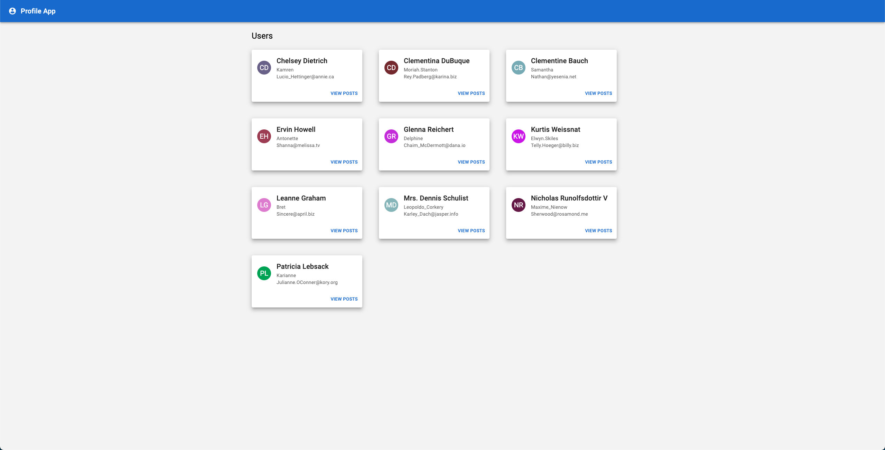
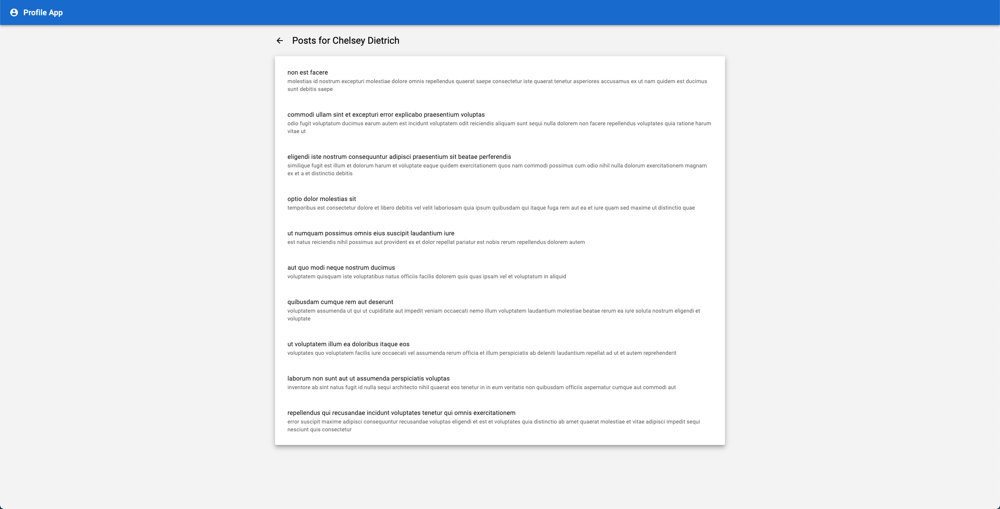
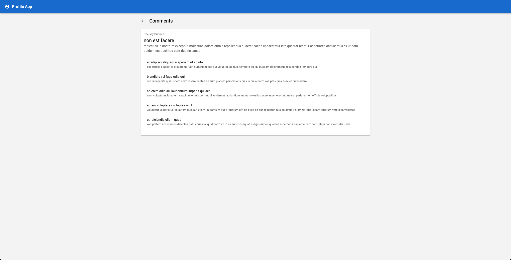
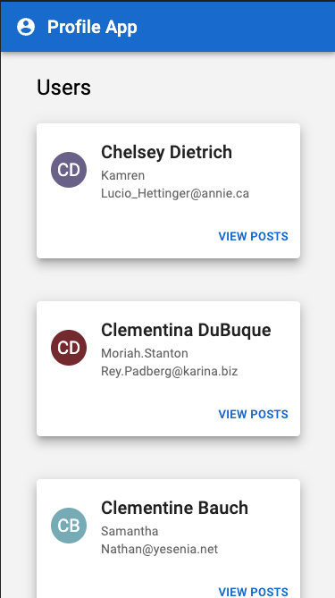
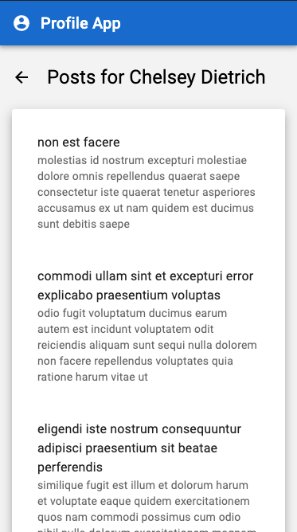
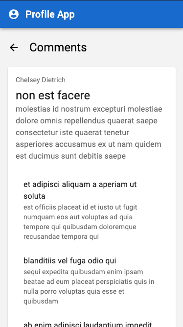

# Profile App Code Challenge

## Goal:

Create a user profile app that displays a list of users, posts, and comments returned from [here!](https://jsonplaceholder.typicode.com/)

## Requirements:

Utilize the libraries already included in the project to build out this app (using Material UI, react query, and react router). The styling should be responsive and work on a variety of screen sizes (desktop/tablet/mobile).

Styling does not need to be exact, but should roughly look the same as the [screenshots](#screenshot-examples) and [video provided](#video-examples).

Specific requirements for components/pages are listed below:

### Header Component

- clicking the user icon button should navigate to the [Users Page](#users-page)

### Users Page

- users are each displayed in a card and cards are sorted by user's name alphabetically
- user avatar displays a 2 letter abbreviation of the user's name with a random background color (helper function provided [here](./src/utils.ts))
- each card contains the user's name, username, email, and a VIEW POSTS button
- clicking the VIEW POSTS button on a user should navigate to the [Posts Page](#posts-page) and display that user's posts

### Posts Page

- page content is displayed in a card
- title should include the user's name in it (ex. clicking on Bob Smith with navigate to the [Posts Page](#posts-page) and display "Posts for Bob Smith" as the title)
- back arrow should navigate back to the [Users Page](#users-page)
- posts are displayed in a list
- post properties in each list item are the post's title and body
- clicking on a post should navigate to the [Comments Page](#comments-page)

### Comments Page

- page content is displayed in a card
- back arrow should navigate to the [Post Page](#posts-page) and show the last post clicked
- first item in the card displays the user's name and the post's title and body
- the second item in the card displays a list of comments for the post clicked
- comment properties in each list item are the comment's name and body

### Map Page

- map of all users
- map points should display users 2 letter abbreviation of the user's name with random backgrounds
- each point should have a pop up with user's name, username, email, and a VIEW POSTS button
- clicking the VIEW POSTS button on a user should navigate to the [Posts Page](#posts-page) and display that user's posts

## Screenshot Examples

## Video Examples

Checkout video examples of the app running [here!](./examples/video-examples/)
